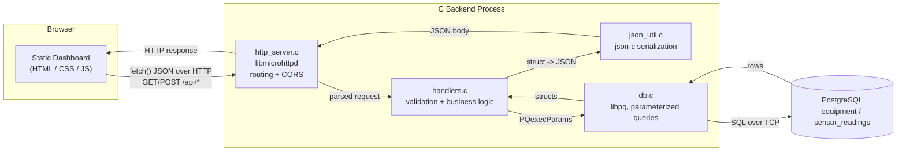

# SensorDataManager-C

A backend system, written in C, that ingests, stores, and serves industrial
sensor readings. It persists everything in PostgreSQL and exposes the data
through an HTTP JSON API consumed by a small web dashboard.

## Overview

Industrial equipment (pumps, motors, compressors, conveyors, turbines) is
typically instrumented with sensors that report temperature, vibration, and
rotational speed. This project models a minimal but realistic slice of that
world: a piece of equipment has many sensor readings over time, and an
operator wants to record new readings, browse historical ones, and see
summary statistics per machine.

SensorDataManager-C solves this with three cleanly separated layers:

1. A **PostgreSQL database** that durably stores equipment and readings.
2. A **C backend** that exposes this data over HTTP as JSON, using libpq for
   database access and libmicrohttpd for the HTTP server.
3. A **static web dashboard** (HTML/CSS/JS, no build step) that lets a user
   submit readings, browse them, and view aggregate statistics.

The domain is intentionally simple. The engineering focus is on a correct,
secure, and cleanly structured C backend: parameterized SQL queries, proper
HTTP status codes, modular source files, and a documented, reproducible
setup from an empty database to a working dashboard.

## Motivation

Most C backend examples either skip the database layer entirely or hard-code
a handful of unsafe string-concatenated queries. This project exists to show
a complete, correct path: a real relational schema with indexes, a C data
access layer that uses parameterized queries throughout, a small but
properly modularized HTTP API, and a frontend that actually consumes it. It
is meant to be readable end to end in one sitting and runnable with a short,
explicit sequence of commands.

## Features

- Insert a new sensor reading (`POST /api/readings`)
- List readings with optional filters by equipment, sensor type, and time
  range, with pagination via a limit (`GET /api/readings`)
- List known equipment (`GET /api/equipment`)
- Aggregate statistics (average, minimum, maximum, sample count) per
  equipment and sensor type, optionally filtered (`GET /api/stats`)
- Health check endpoint that also verifies database connectivity
  (`GET /api/health`)
- JSON request/response bodies with correct HTTP status codes (`200`, `201`,
  `400`, `404`, `500`, `503`)
- CORS enabled, so the static frontend can call the API directly from the
  filesystem or any local static server
- A seed script that creates the schema and loads a realistic sample time
  series (5 pieces of equipment x 3 sensor types x 48 hourly readings)

## Architecture



**Data flow for a request:** the browser dashboard calls the API with
`fetch()`. `http_server.c` accepts the TCP connection, parses the HTTP
method/URL/query string/body, and hands a plain request to `handlers.c`.
Handlers validate input, open a short-lived PostgreSQL connection, and call
into `db.c`, which runs a parameterized query via libpq and returns plain C
structs. `json_util.c` turns those structs into a `json-c` object, which the
handler serializes to a string. `http_server.c` sends that string back as
the HTTP response body with the right status code and CORS headers.

### Layer responsibilities

| Layer | Location | Responsibility |
|---|---|---|
| Frontend | `frontend/` | Renders the UI, calls the API with `fetch()`, has no business logic of its own |
| HTTP transport | `backend/src/http_server.c` | Accepts connections, routes method+path to a handler, manages CORS and body buffering, has no SQL knowledge |
| Request handlers | `backend/src/handlers.c` | Validates input, orchestrates a database call, maps errors to HTTP status codes |
| JSON serialization | `backend/src/json_util.c` | Converts domain structs to `json-c` objects |
| Data access | `backend/src/db.c` | Runs parameterized SQL via libpq, maps rows back to structs, has no HTTP knowledge |
| Database | PostgreSQL (`sql/schema.sql`) | Durable storage, referential integrity, indexing |

This separation means the database layer could be unit-tested without an
HTTP server, and the HTTP transport could be swapped (for example to a
different C HTTP library) without touching `db.c` or the SQL.

## Technology stack

| Concern | Choice |
|---|---|
| Backend language | C (C11) |
| Database | PostgreSQL |
| Database client | libpq (official PostgreSQL C client library) |
| HTTP server | libmicrohttpd |
| JSON | json-c |
| Frontend | Plain HTML, CSS, JavaScript (no framework, no build step) |
| Build | GNU Make |

## Repository structure

```
SensorDataManager-C/
├── README.md                 This file
├── LICENSE                   MIT license
├── .gitignore
├── backend/                  C HTTP API
│   ├── include/                Public headers (one per module)
│   ├── src/                    Implementation files
│   ├── Makefile
│   └── README.md               Backend-specific build/run instructions
├── frontend/                 Static web dashboard
│   ├── index.html
│   ├── css/style.css
│   ├── js/app.js
│   └── README.md               Frontend-specific run instructions
├── sql/                       Database schema and sample data
│   ├── schema.sql
│   └── seed.sql
└── scripts/                   Convenience scripts
    ├── setup_db.sh             Linux/macOS: create DB, apply schema, seed data
    ├── setup_db.ps1            Windows PowerShell equivalent
    └── run_backend.sh           Build and start the backend
```

## Database schema

Two tables, defined in [`sql/schema.sql`](sql/schema.sql):

**`equipment`** - the physical assets being monitored.

| Column | Type | Notes |
|---|---|---|
| `id` | `SERIAL PRIMARY KEY` | |
| `name` | `TEXT NOT NULL UNIQUE` | e.g. `Pump-01` |
| `equipment_type` | `TEXT NOT NULL` | e.g. `pump`, `motor`, `compressor` |
| `location` | `TEXT` | e.g. `Plant A - Line 1` |
| `created_at` | `TIMESTAMPTZ NOT NULL DEFAULT now()` | |

**`sensor_readings`** - individual time-stamped measurements.

| Column | Type | Notes |
|---|---|---|
| `id` | `BIGSERIAL PRIMARY KEY` | |
| `equipment_id` | `INTEGER NOT NULL REFERENCES equipment(id) ON DELETE CASCADE` | |
| `sensor_type` | `TEXT NOT NULL CHECK (...)` | one of `temperature`, `vibration`, `rotational_speed` |
| `value` | `DOUBLE PRECISION NOT NULL` | |
| `unit` | `TEXT NOT NULL` | e.g. `C`, `mm/s`, `rpm` |
| `recorded_at` | `TIMESTAMPTZ NOT NULL DEFAULT now()` | when the measurement was taken |
| `created_at` | `TIMESTAMPTZ NOT NULL DEFAULT now()` | when the row was inserted |

Indexes on `equipment_id`, `sensor_type`, `recorded_at`, and a composite
index on `(equipment_id, sensor_type, recorded_at)` support the API's
filtering and sorting patterns efficiently. A foreign key with
`ON DELETE CASCADE` keeps readings consistent if equipment is removed, and a
`CHECK` constraint on `sensor_type` enforces the sensor vocabulary at the
database level as a second line of defense behind application-level
validation.

## Installation and setup

These steps take the project from nothing to a running dashboard. They are
written for Ubuntu/Debian Linux (or WSL on Windows); see
[backend/README.md](backend/README.md) for other platforms.

### 1. Install system dependencies

```bash
sudo apt-get update
```

```bash
sudo apt-get install -y build-essential pkg-config libpq-dev libmicrohttpd-dev libjson-c-dev postgresql postgresql-client
```

### 2. Start PostgreSQL (if not already running)

```bash
sudo service postgresql start
```

### 3. Set a password for the postgres role (first time only)

```bash
sudo -u postgres psql -c "ALTER USER postgres PASSWORD 'postgres';"
```

### 4. Create the database, apply the schema, and load sample data

```bash
SDM_DB_PASSWORD=postgres bash scripts/setup_db.sh
```

On Windows with PostgreSQL client tools installed natively, use
`scripts/setup_db.ps1` instead. This runs
[`sql/schema.sql`](sql/schema.sql) then [`sql/seed.sql`](sql/seed.sql)
against the target database.

### 5. Build the backend

```bash
cd backend && make
```

### 6. Run the backend

```bash
SDM_DB_PASSWORD=postgres ./bin/sensor_data_manager
```

The server listens on `http://localhost:8080` by default. See
[backend/README.md](backend/README.md) for the full list of environment
variables.

### 7. Open the frontend

```bash
cd ../frontend && python3 -m http.server 5500
```

Then open `http://localhost:5500` in a browser. See
[frontend/README.md](frontend/README.md) for alternative ways to serve it,
including simply opening `index.html` directly.

## API reference

All responses are JSON. All list endpoints and the create endpoint return a
JSON object (never a bare array), so new fields can be added without
breaking clients.

### `GET /api/health`

Checks that the server is running and can reach the database.

```bash
curl http://localhost:8080/api/health
```

```json
{
  "status": "ok",
  "database": "connected"
}
```

Returns `503` with `"status": "degraded"` if the database is unreachable.

### `GET /api/equipment`

Lists all known equipment.

```bash
curl http://localhost:8080/api/equipment
```

```json
{
  "count": 5,
  "equipment": [
    {
      "id": 1,
      "name": "Pump-01",
      "equipment_type": "pump",
      "location": "Plant A - Line 1",
      "created_at": "2026-09-13T10:00:00Z"
    }
  ]
}
```

### `POST /api/readings`

Inserts a new sensor reading.

| Field | Type | Required | Notes |
|---|---|---|---|
| `equipment_id` | integer | yes | must reference an existing equipment row |
| `sensor_type` | string | yes | one of `temperature`, `vibration`, `rotational_speed` |
| `value` | number | yes | |
| `unit` | string | no | defaults to `C`, `mm/s`, or `rpm` based on `sensor_type` |
| `recorded_at` | string (ISO 8601) | no | defaults to the server's current time |

```bash
curl -X POST http://localhost:8080/api/readings \
  -H "Content-Type: application/json" \
  -d '{"equipment_id": 1, "sensor_type": "temperature", "value": 62.4}'
```

```json
{
  "id": 721,
  "equipment_id": 1,
  "equipment_name": "Pump-01",
  "sensor_type": "temperature",
  "value": 62.4,
  "unit": "C",
  "recorded_at": "2026-09-15T14:32:10Z",
  "created_at": "2026-09-15T14:32:10Z"
}
```

Returns `201` on success, `400` for invalid or missing fields, and `404` if
`equipment_id` does not exist.

### `GET /api/readings`

Lists readings, most recent first.

| Query parameter | Notes |
|---|---|
| `equipment_id` | filter to one piece of equipment |
| `sensor_type` | filter to one sensor type |
| `from` | ISO 8601 timestamp, inclusive lower bound on `recorded_at` |
| `to` | ISO 8601 timestamp, inclusive upper bound on `recorded_at` |
| `limit` | max rows to return, default 100, capped at 1000 |

```bash
curl "http://localhost:8080/api/readings?equipment_id=1&sensor_type=temperature&limit=2"
```

```json
{
  "count": 2,
  "readings": [
    {
      "id": 721,
      "equipment_id": 1,
      "equipment_name": "Pump-01",
      "sensor_type": "temperature",
      "value": 62.4,
      "unit": "C",
      "recorded_at": "2026-09-15T14:32:10Z",
      "created_at": "2026-09-15T14:32:10Z"
    },
    {
      "id": 715,
      "equipment_id": 1,
      "equipment_name": "Pump-01",
      "sensor_type": "temperature",
      "value": 58.1,
      "unit": "C",
      "recorded_at": "2026-09-15T13:00:00Z",
      "created_at": "2026-09-13T10:05:00Z"
    }
  ]
}
```

### `GET /api/stats`

Returns average, minimum, maximum, and sample count, grouped by equipment
and sensor type.

| Query parameter | Notes |
|---|---|
| `equipment_id` | filter to one piece of equipment |
| `sensor_type` | filter to one sensor type |

```bash
curl "http://localhost:8080/api/stats?equipment_id=1"
```

```json
{
  "count": 3,
  "stats": [
    {
      "equipment_id": 1,
      "equipment_name": "Pump-01",
      "sensor_type": "temperature",
      "average": 61.87,
      "minimum": 55.02,
      "maximum": 69.93,
      "sample_count": 49
    },
    {
      "equipment_id": 1,
      "equipment_name": "Pump-01",
      "sensor_type": "vibration",
      "average": 1.74,
      "minimum": 0.51,
      "maximum": 2.98,
      "sample_count": 48
    },
    {
      "equipment_id": 1,
      "equipment_name": "Pump-01",
      "sensor_type": "rotational_speed",
      "average": 1548.32,
      "minimum": 1401.10,
      "maximum": 1698.77,
      "sample_count": 48
    }
  ]
}
```

### Errors

All error responses share one shape:

```json
{ "error": "Field 'sensor_type' must be one of: temperature, vibration, rotational_speed" }
```

## Results

Once the steps above are followed, the running system provides:

- A PostgreSQL database with two tables holding 5 equipment records and
  roughly 720 seeded sensor readings spanning the last 48 hours.
- A C backend listening on port 8080, answering every request in the API
  reference above with correctly parameterized queries and proper status
  codes, confirmed by the `curl` examples above.
- A dashboard at `frontend/index.html` with three panels:
  - **Submit a Reading**: a form (equipment dropdown, sensor type, value,
    optional unit and timestamp) that posts to `POST /api/readings` and
    refreshes the tables below on success.
  - **Readings**: a filterable, sortable-by-recency table of individual
    readings with equipment/sensor/time-range filters and a row limit.
  - **Aggregate Statistics**: a table of average/min/max/sample-count per
    equipment and sensor type, with the same filters.
  - A header status indicator that pings `/api/health` on load and shows
    whether the API and database are reachable.

Because the backend validates every input at the application layer (integer
parsing, allowed sensor types, positive limits) before touching the
database, and every query is parameterized through libpq's
`PQexecParams`, malformed or hostile input results in a clean `400`
response rather than a SQL error or an injection vector.

## Limitations and future work

- **Connection-per-request**: each API request opens and closes its own
  PostgreSQL connection rather than using a pooled or persistent
  connection. This is simple and thread-safe but adds latency under load; a
  connection pool (for example via `pgbouncer` or a hand-rolled pool in
  `db.c`) would be the natural next step.
- **No authentication**: the API has no auth layer. It is meant to run
  behind a trusted network boundary or be extended with an API key /
  bearer token check in `handlers.c` before production use.
- **No automated tests**: the project ships without a test suite. Given the
  layering (`db.c` has no HTTP dependency, `handlers.c` has no
  libmicrohttpd dependency), unit tests against a disposable test database
  and integration tests against the HTTP API are both straightforward to
  add.
- **Single-process, no TLS**: the backend serves plain HTTP. A production
  deployment would sit behind a reverse proxy (nginx, Caddy) terminating
  TLS.
- **Fixed sensor vocabulary**: `sensor_type` is limited to three values by
  a `CHECK` constraint. Adding a sensor type currently requires a schema
  migration; a lookup table would make it data-driven.

## License

MIT. See [LICENSE](LICENSE).
